# Diagrama de Paquetes — Modelo Arquitectónico del Backend MoonPhases

## Diagrama General de Paquetes

El backend sigue una **arquitectura Clean Architecture** (Arquitectura Limpia) con **8 módulos de dominio**, cada uno organizado en 3 capas internas: `domain`, `application` e `infrastructure`.

```mermaid
graph TB
    subgraph "🌙 back-moon-p [Backend MoonPhases]"

        subgraph "📡 Capa de Presentación [Controllers + DTOs]"
            AC["auth.controller"]
            UC["users.controller"]
            PC["products.controller"]
            CC["categories.controller"]
            CRC["cart.controller"]
            CPC["coupons.controller"]
            SC["shipping.controller"]
            OC["orders.controller"]
        end

        subgraph "⚙️ Capa de Aplicación [Use Cases]"
            AUC["Auth Use Cases"]
            UUC["Users Use Cases"]
            PUC["Products Use Cases"]
            CAUC["Categories Use Cases"]
            CRUC["Cart Use Cases"]
            CPUC["Coupons Use Cases"]
            SUC["Shipping Use Cases"]
            OUC["Orders Use Cases"]
        end

        subgraph "🏛️ Capa de Dominio [Entities + Interfaces]"
            AD["Auth Interfaces"]
            UD["User Entity + Interface"]
            PD["Product Entity + Interface"]
            CAD["Category Entity + Interface"]
            CRD["CartItem Entity + Interface"]
            CPD["Coupon Entity + Interface"]
            SD["ShippingAddress Entity + Interface"]
            OD["Order Entity + Interface"]
        end

        subgraph "🔌 Capa de Infraestructura [Repositories]"
            AR["SupabaseAuthRepository"]
            UR["SupabaseUserRepository"]
            PR["SupabaseProductRepository"]
            CAR["SupabaseCategoryRepository"]
            CRR["SupabaseCartRepository"]
            CPR["SupabaseCouponRepository"]
            SR["SupabaseShippingRepository"]
            OR["SupabaseOrderRepository"]
        end

        subgraph "🛡️ Paquete Común [common/]"
            GU["Guards: AuthGuard, RolesGuard"]
            DE["Decorators: @Roles, @CurrentUser"]
            EX["Exceptions: throwSupabaseError"]
            DTO["ApiResponse DTO"]
        end

        subgraph "☁️ Supabase Service"
            SS["SupabaseService: client + adminClient"]
        end
    end

    subgraph "🗄️ Servicios Externos"
        SB[("Supabase PostgreSQL + Auth + Storage")]
    end

    AC --> AUC
    UC --> UUC
    PC --> PUC
    CC --> CAUC
    CRC --> CRUC
    CPC --> CPUC
    SC --> SUC
    OC --> OUC

    AUC --> AD
    UUC --> UD
    PUC --> PD
    CAUC --> CAD
    CRUC --> CRD
    CPUC --> CPD
    SUC --> SD
    OUC --> OD

    AR -.->|implementa| AD
    UR -.->|implementa| UD
    PR -.->|implementa| PD
    CAR -.->|implementa| CAD
    CRR -.->|implementa| CRD
    CPR -.->|implementa| CPD
    SR -.->|implementa| SD
    OR -.->|implementa| OD

    AR --> SS
    UR --> SS
    PR --> SS
    CAR --> SS
    CRR --> SS
    CPR --> SS
    SR --> SS
    OR --> SS

    SS --> SB

    AC --> GU
    UC --> GU
    PC --> GU
    CRC --> GU
    CPC --> GU
    SC --> GU
    OC --> GU

    AC --> DE
    UC --> DE
    PC --> DE
    CRC --> DE
    CPC --> DE
    SC --> DE
    OC --> DE

    AR --> EX
    UR --> EX
    PR --> EX
    CAR --> EX
    CRR --> EX
    CPR --> EX
    SR --> EX
    OR --> EX
```

---

## Diagrama Detallado por Módulo

Cada módulo de dominio sigue exactamente la misma estructura interna de 3 capas:

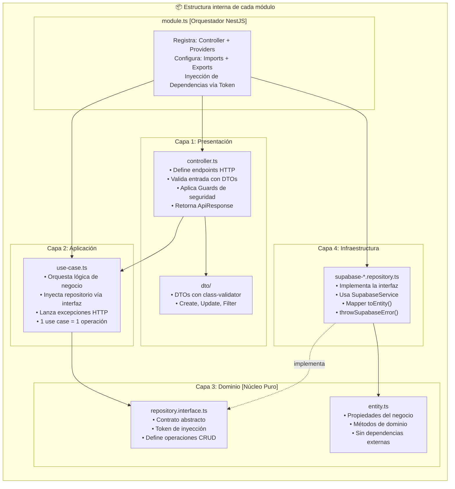

---

## Diagrama de Dependencias entre Módulos

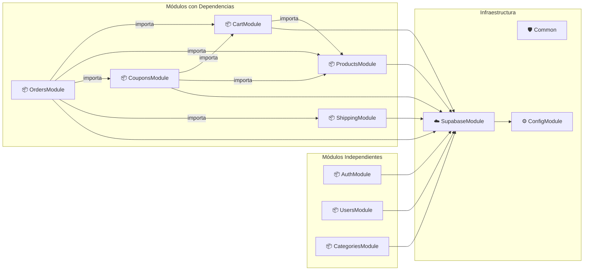

---

## Diagrama de cada Módulo — Contenido Detallado

### 📦 AuthModule (CU01)
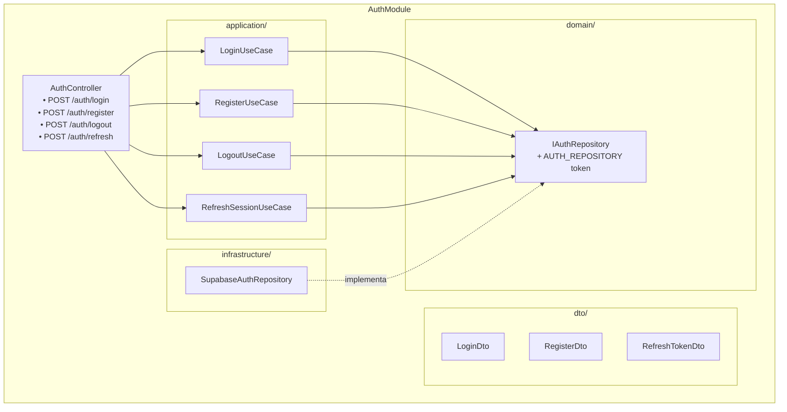

### 📦 UsersModule
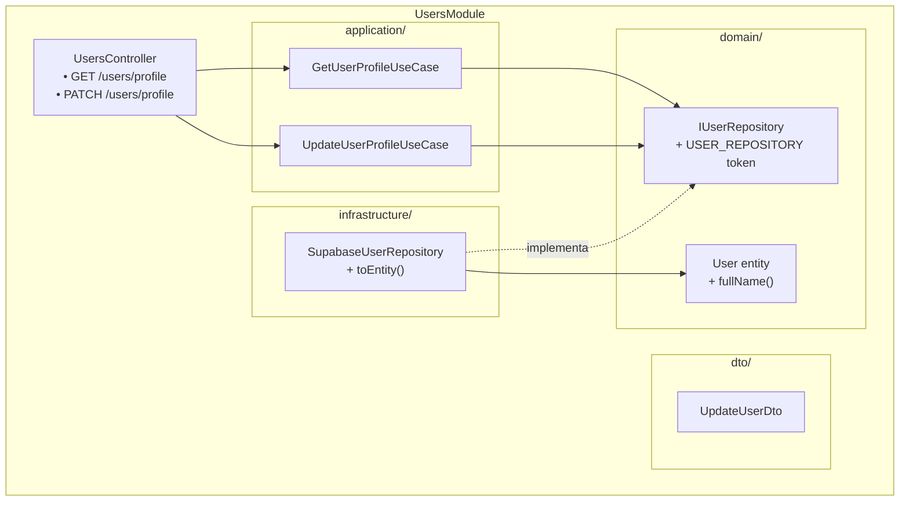

### 📦 ProductsModule (CU04)
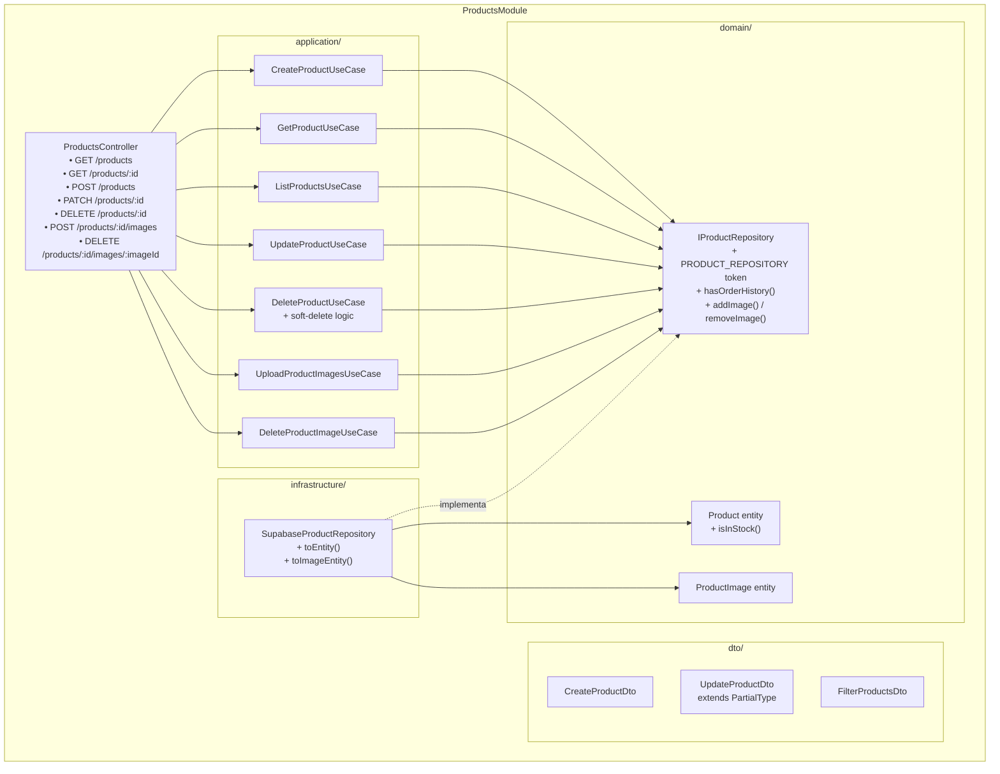

### 📦 CartModule (CU02)
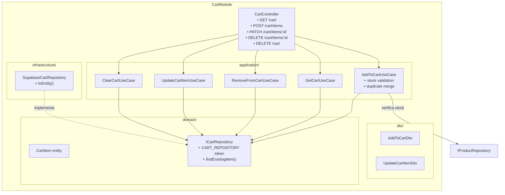

### 📦 CouponsModule (CU05 + CU06)
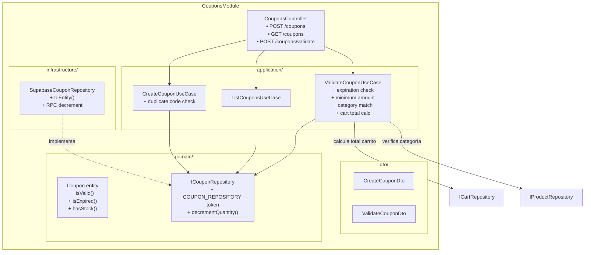

### 📦 OrdersModule (CU03 + CU07 + CU08)
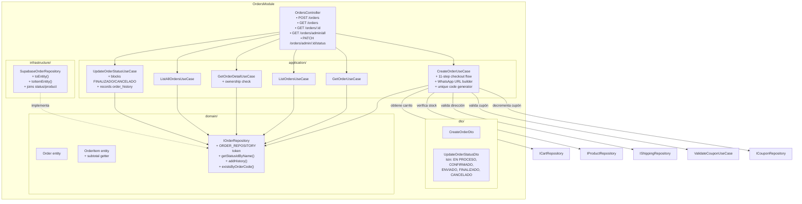

### 📦 ShippingModule
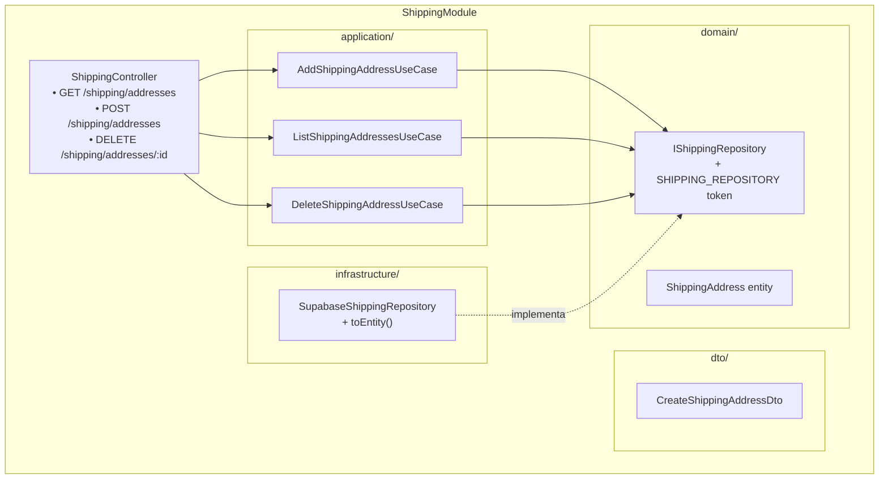

### 📦 CategoriesModule
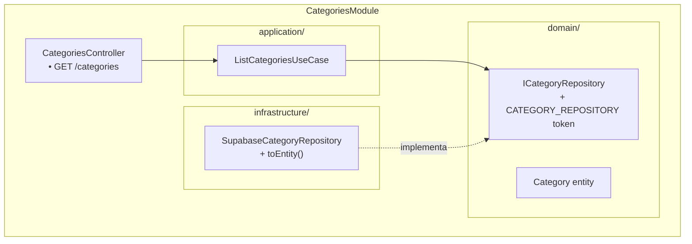

---

## Paquete Común — Detalle

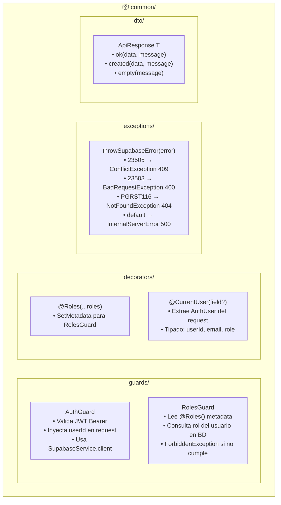

---

## Guía para recrear en Draw.io

### Convenciones de colores sugeridas

| Capa | Color de fondo | Color del borde |
|---|---|---|
| **Presentación** (Controllers + DTOs) | `#DBEAFE` (azul claro) | `#3B82F6` (azul) |
| **Aplicación** (Use Cases) | `#FEF3C7` (amarillo claro) | `#F59E0B` (amarillo) |
| **Dominio** (Entities + Interfaces) | `#D1FAE5` (verde claro) | `#10B981` (verde) |
| **Infraestructura** (Repositories) | `#FEE2E2` (rojo claro) | `#EF4444` (rojo) |
| **Común** (Guards, Decorators) | `#E5E7EB` (gris claro) | `#6B7280` (gris) |
| **Supabase** | `#EDE9FE` (púrpura claro) | `#8B5CF6` (púrpura) |
| **Externo** (BD) | `#F3F4F6` | `#374151` |

### Tipos de flechas

| Flecha | Significado | Estilo en Draw.io |
|---|---|---|
| `───────►` | **Dependencia directa** (usa/llama) | Línea sólida con punta |
| `- - - - ►` | **Implementa interfaz** | Línea discontinua con triángulo vacío |
| `═══════►` | **Importa módulo NestJS** | Línea gruesa sólida |

### Pasos para recrear

1. **Crear un frame principal** titulado `back-moon-p`
2. **Crear 4 filas horizontales** (Presentación, Aplicación, Dominio, Infraestructura)
3. **Colocar 8 paquetes** UML por fila (uno por módulo)
4. **Colocar paquetes transversales** a la derecha: `common/` y `SupabaseService`
5. **Dibujar flechas** sólidas hacia abajo (capa superior → capa inferior)
6. **Dibujar flechas** discontinuas hacia arriba (Infrastructure → Domain, implementa interfaz)
7. **Dibujar flechas** horizontales entre módulos (dependencias inter-módulo)

### Estructura UML de paquete en Draw.io

Para cada módulo usa el shape **Package** de UML:

```
┌─────────────────────────────┐
│ «paquete»                   │
│ NombreMódulo                │
├─────────────────────────────┤
│  ┌──────────────────────┐   │
│  │ domain/              │   │
│  │  • Entity            │   │
│  │  • IRepository       │   │
│  └──────────────────────┘   │
│  ┌──────────────────────┐   │
│  │ application/         │   │
│  │  • UseCase1          │   │
│  │  • UseCase2          │   │
│  └──────────────────────┘   │
│  ┌──────────────────────┐   │
│  │ infrastructure/      │   │
│  │  • SupabaseRepo      │   │
│  └──────────────────────┘   │
│  ┌──────────────────────┐   │
│  │ dto/                 │   │
│  │  • CreateDto         │   │
│  │  • UpdateDto         │   │
│  └──────────────────────┘   │
│  controller.ts              │
│  module.ts                  │
└─────────────────────────────┘
```
